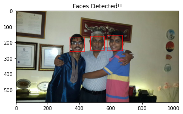

# Face-Detection-using-Computer-Vision
Using cv2 library to detect faces from the available dataset

# About

**I used libraries like opencv to make a face detection algorithm for identifying faces and making a rectangle around them, the Datasets were some downloaded images in laptop**

# Library

1. **[Numpy](https://numpy.org/doc/stable/reference/generated/numpy.array.html)**

2. **[Matplotlib](https://matplotlib.org/) for image reading and visualizations** 

3. **[Opencv](https://opencv-python-tutroals.readthedocs.io/en/latest/py_tutorials/py_tutorials.html) for face detection classifier called [CascadeClassifier](https://docs.opencv.org/3.4/db/d28/tutorial_cascade_classifier.html)**

# To Get Started

1. **`pip install cv2` for getting started with Opencv**

2. **`pip install numpy` and `pip install matplotlib` for other functions**

# Results

**THE DATASET USED**

**OUTPUT**

